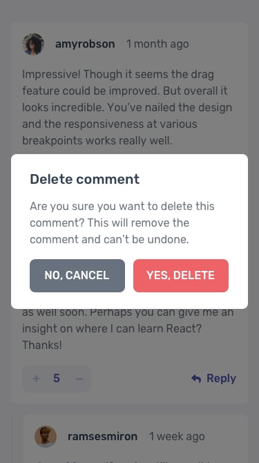

# Frontend Mentor - Interactive comments section

## Welcome! 👋

Frontend Mentor's Interactive comments section

### Additional Features
  - Its a MERN App
  - Users can login and signup
  - Unauthenticated users cant send a comment, reply or even upvote and downvote.
  - Action Loaders 

### Design

- #### Desktop Design
    
    
    

    
- #### Mobile Design
    
    

### Links

-   Solution URL: [here](https://www.frontendmentor.io/solutions/interactive-comments-section-mern-with-login-and-register-page-2REE6kU43e)
-   Live Site URL: [here](https://interactive-comments-section-olive.vercel.app/)

### Built with
-   MongoDB
-   EXPRESS
-   REACT
-   NODEJS
-   Mongoose
-   MongoDB Atlas
-   JSON WEB TOKENS (JWT)
-   REACT HOOKS
-   TailwindCSS
-   REACT ROUTER V6.8
-   VITE
-   Mobile-first workflow